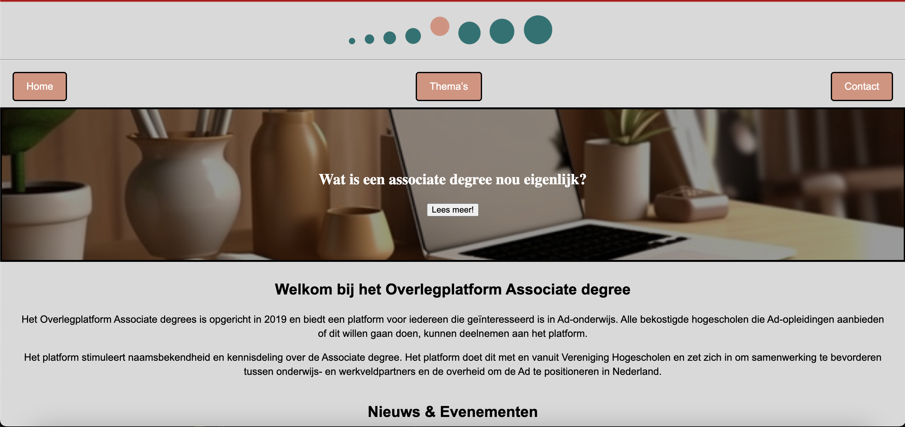

ADConnect – Overlegplatform Associate Degree
Live URL: https://mohamedelib.github.io/the-client-website/

Intro

De opdracht was om een toegankelijke en informatieve website te maken voor het Overlegplatform Associate Degree.
Het doel is om een centrale plek te creëren waar docenten, studenten, beleidsmakers en toekomstige werkgevers snel informatie kunnen vinden over de Associate degree, nieuws & evenementen kunnen bekijken, en contact kunnen opnemen met het platform.

 Beschrijving

De ADConnect website is opgebouwd als een overzichtelijke, statische website met navigatiestructuur en informatieve secties.
De homepage bevat:

Een header met logo en navigatiebalk

Een korte introductie over het platform en de Associate degree

Een sectie met nieuws en evenementen

Een overzicht van deelnemende hogescholen

Een footer met contactinformatie en bestuursleden

💻 Desktopweergave

📱 Mobiele weergave

De website is responsief, wat betekent dat de lay-out zich aanpast aan verschillende schermformaten, zoals laptops, tablets en smartphones.

Kenmerken HTML

structuur met <header>, <main>, <section>, <footer>

Navigatiemenu als ongeordende lijst <ul> met knoppen

Introductieteksten en nieuwssecties duidelijk gestructureerd

Afbeeldingen met alt-attributen voor toegankelijkheid

CSS

Externe stylesheet styles/styles.css voor overzicht en herbruikbaarheid

Gebruik van grid en flexbox voor de lay-out

Responsive design met media queries voor verschillende schermgroottes

Eenvoudige, toegankelijke knoppen en hover-effecten

Navigatie

Bovenaan: Home | Thema’s | Contact

Footer bevat contactinformatie en namen van het dagelijks bestuur

Conventies

Alt-teksten voor alle afbeeldingen

Consistente heading-structuur (<h1>, <h2>)

Pure HTML en CSS voor maximale controle en eenvoud

Gemaakt door

Naam: Mohamed El Ibrahymy
Team: Squad 1I
Opleiding: Front-end & Development – Hogeschool van Amsterdam
Periode: 2025

Mogelijke uitbreidingen

Hamburger-menu voor mobiel navigeren

Zoekfunctie voor thema’s

Meertalige versie (NL / EN)
